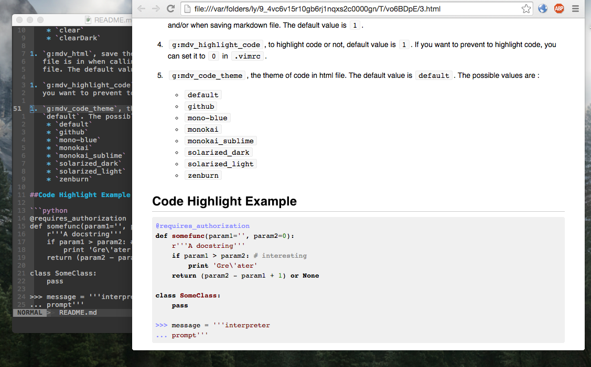

MarkdownViewer.vim
===================
Parse markdown to html and preview it, compatible with [GitHub flavored
markdown](https://help.github.com/articles/github-flavored-markdown).


##Install
1. Install `node.js` and `npm`.
1. Install `marked` and `highlight.js` packages globally
    * `npm install -g marked`
    * `npm install -g highlight.js`
    * `npm install -g mermaid`
1. Set `NODE_PATH` environment variable
    * add `export NODE_PATH=/usr/lib/node_modules:$NODE_PATH` to ` ~/.bash_profile` or `~/.zshrc`
    * See http://stackoverflow.com/questions/13465829/node-js-modules-path for more infomation
1. Copy the `after` folder to `~/.vim`.
1. Ensure you have the line `filetype plugin on` in your `.vimrc`.
1. Open a markdown file in `vim` and execute command `:MkdView`. Enjoy it!

##Usage
1. `:MkdView`, to preview markdown file. The default key map `<leader>v`
   calls this command.

1. `:Mkd2html`, converting markdown file to html file and store html file.

1. `:MkdMail config-name`, send an email with the html to someone. This command
   needs python support and the `g:mkd_mail_config` should be set.

##Screenshot



##Configuration

1. `g:mdv_theme` , the theme of html file. The available values are :
    * `github2`, the default
    * `github`
    * `clear`
    * `clearDark`

1. `g:mdv_highlight_code`, to highlight code or not, default value is `1`. If
   you want to prevent to highlight code, you can set it to `0` in `.vimrc`.

1. `g:mdv_code_theme`, the theme of code in html file. The default value is
   `default`. The possible values are :
    * `arta`
    * `ascetic`
    * `atelier-dune.dark`
    * `atelier-dune.light`
    * `atelier-forest.dark`
    * `atelier-forest.light`
    * `atelier-heath.dark`
    * `atelier-heath.light`
    * `atelier-lakeside.dark`
    * `atelier-lakeside.light`
    * `atelier-seaside.dark`
    * `atelier-seaside.light`
    * `codepen-embed`
    * `color-brewer`
    * `dark`
    * `default`
    * `docco`
    * `far`
    * `foundation`
    * `github`
    * `googlecode`
    * `hybrid`
    * `idea`
    * `ir_black`
    * `kimbie.dark`
    * `kimbie.light`
    * `magula`
    * `mono-blue`
    * `monokai`
    * `monokai_sublime`
    * `obsidian`
    * `paraiso.dark`
    * `paraiso.light`
    * `railscasts`
    * `rainbow`
    * `solarized_dark`
    * `solarized_light`
    * `sunburst`
    * `tomorrow-night-blue`
    * `tomorrow-night-bright`
    * `tomorrow-night-eighties`
    * `tomorrow-night`
    * `tomorrow`
    * `vs`
    * `xcode`
    * `zenburn`

1. `g:mdv_mail_config`, the configuration for `:MkdMail` command. All the
   configuration should be written in `~/mdv_mail_config.vim`. Below is an
   example:

```vimscript

" ~/mdv_mail_config.vim

let g:mdv_mail_config = {}

let g:mdv_mail_config['example'] = {
    \ 'from': 'abc@example.com',
    \ 'to': ['xyz@example.com'],
    \ 'cc': ['mnq@example.com'],
    \ 'server_host': 'smtp.example.com',
    \ 'server_port': 25,
    \ 'login_name': 'abc@example.com',
    \ 'login_pwd': 'the-password'
    \ }

let g:mdv_mail_config['example2'] = {
    \ 'from': 'abc2@example.com',
    \ 'to': ['xyz2@example.com'],
    \ 'cc': [],
    \ 'server_host': 'smtp.example.com',
    \ 'server_port': 25,
    \ 'login_name': 'abc2@example.com',
    \ 'login_pwd': 'the-password-2'
    \ }

```

Then, executing `:MkdMail example` command will use the `example` configuration
to mail the current file content to `xyz@example.com`.

##Change Log
* 2016-01-21
    - Remove `g:mdv_loaded`, `g:mdv_html`
* 2015-11-09
    - bug fix for heading, see https://github.com/chjj/marked/issues/642

* 2015-05-29
    - add `:MkdMail` command

* 2015-01-15
    - add highlight for code

##Next
1. better image support


